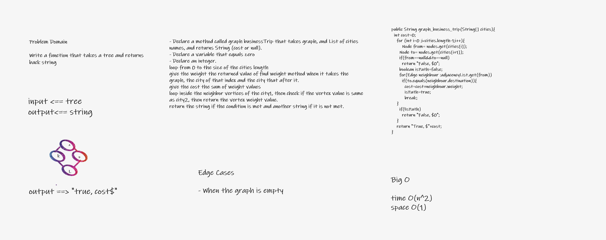

# Challenge Summary
Write a function called business trip

Arguments: graph, array of city names

Return: cost or null

## Whiteboard Process

## Approach & Efficiency

Time=o(n^2)

Space=o(1)

## Solution

String[] fly1={"Naboo", "Pandora"};

System.out.println(graph.graph_business_trip(fly1));
