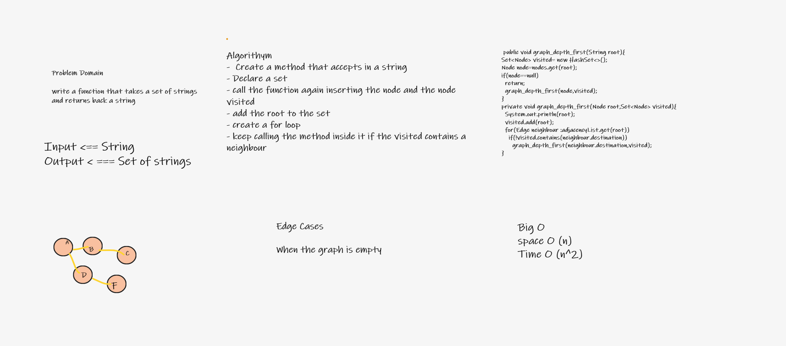

## Challenge
Write the following method for the Graph class:

Name: Depth first

Arguments: Node (Starting point of search)

Return: A collection of nodes in their pre-order depth-first traversal order

Program output: Display the collection

## Whiteboard Process

## Approach & Efficiency

Time=o(n^2)

Space=o(n)

## Solution

graph.graph_depth_first("Arendelle");

