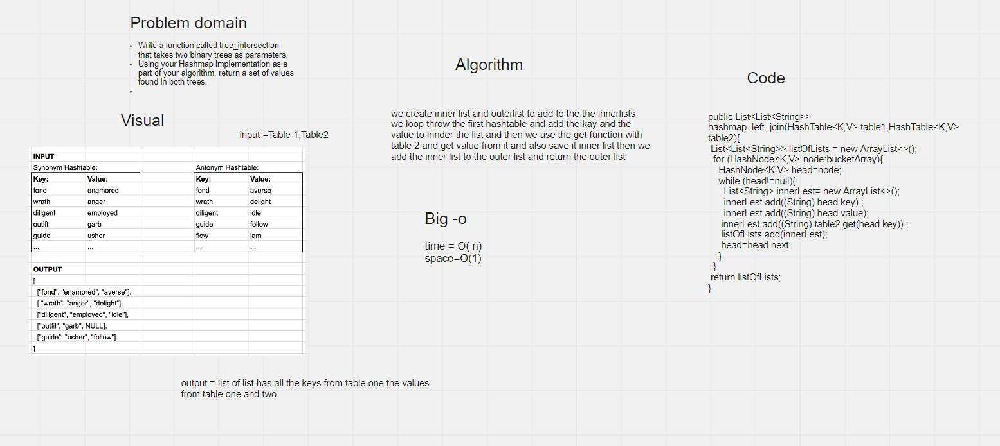

# Challenge Summary
Write a function called left join
Arguments: two hash maps
The first parameter is a hashmap that has word strings as keys, and a synonym of the key as values.
The second parameter is a hashmap that has word strings as keys, and antonyms of the key as values.
Return: The returned data structure that holds the results is up to you. It doesn’t need to exactly match the output below, so long as it achieves the LEFT JOIN logic


## Whiteboard Process



## Approach & Efficiency

we create inner list and outerlist to add to the the innerlists
we loop throw the first hashtable and add the kay and the value to innder the list and then we use the get function with table 2 and get value from it and also save it inner list then we add the inner list to the outer list and return the outer list

time=(o)n

space=o(n)
## Solution
```angular2html
HashTable<String, String> hashTable1 = new HashTable<>();
HashTable<String, String> hashTable2 = new HashTable<>();

hashTable1.add("fond", "enamored");
hashTable1.add("wrath", "anger");
hashTable1.add("diligent", "employed");
hashTable1.add("outfit", "garb");
hashTable1.add("guide", "usher");

hashTable2.add("fond", "averse");
hashTable2.add("wrath", "delight");
hashTable2.add("diligent", "idle");
hashTable2.add("guide", "follow");
hashTable2.add("flow", "jam");
List<List<String>> listOfLists =hashTable1.hashmap_left_join(hashTable1,hashTable2);
  System.out.println(listOfLists);
```
outPut

[[diligent, employed, idle], [wrath, anger, delight], [fond, enamored, averse], [guide, usher, follow], [outfit, garb, null]]
