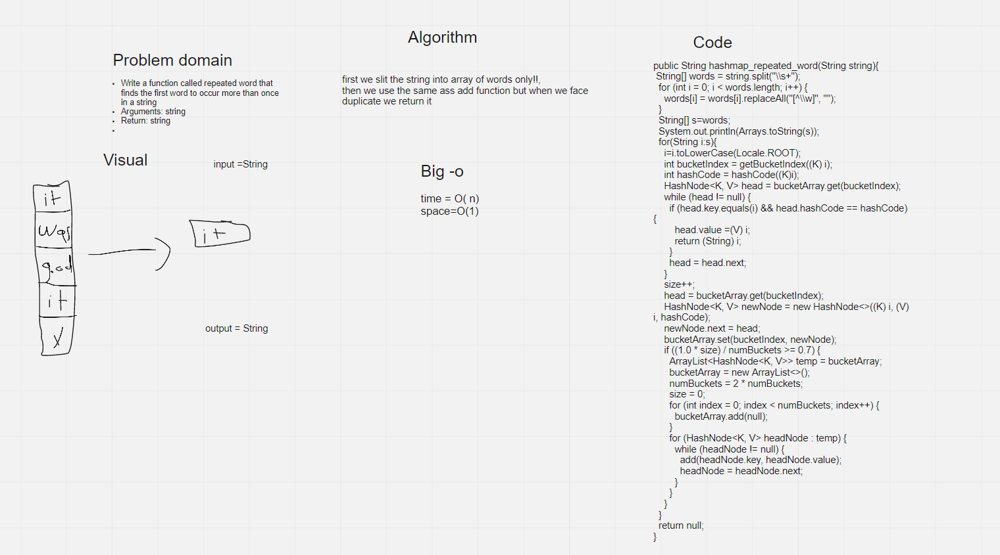

# Challenge Summary
Write a function called repeated word that finds the first word to occur more than once in a string

Arguments: string

Return: string


## Whiteboard Process



## Approach & Efficiency
first we split the string into array of words only!!,

then we use the same as add function but when we face duplicate we return it

time =o(n)

space=o(1)

## Solution

```angular2html
String s="It was a queer, sultry summer, the summer they electrocuted the Rosenbergs, and I didn’t know what I was doing in New York...";
System.out.println(studentAllowances.hashmap_repeated_word(s));
```
it will return summer
