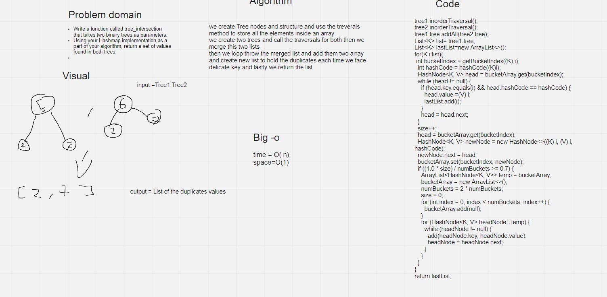

# Challenge Summary
Write a function called tree_intersection that takes two binary trees as parameters.
Using your Hashmap implementation as a part of your algorithm, return a set of values found in both trees.


## Whiteboard Process


## Approach & Efficiency

we create Tree nodes and structure and use the treverals method to store all the elements inside an array
we create two trees and call the traversals for both then we merge this two lists
then we loop throw the merged list and add them two array and create new list to hold the duplicates each time we face delicate key and lastly we return the list

time=(o)n

space=o(n)
## Solution
```angular2html
 HashTable<String,String> hashTable = new HashTable<>();
    TreeStrucutre<String> tree1= new TreeStrucutre();
    tree1.insert("150");
    tree1.insert("100");
    tree1.insert("250");
    tree1.insert("75");
    tree1.insert("160");
    tree1.insert("200");
    tree1.insert("350");
    tree1.insert("300");
    tree1.insert("500");
    tree1.insert("125");
    tree1.insert("175");
    TreeStrucutre<String> tree2= new TreeStrucutre();
    tree2.insert("42");
    tree2.insert("100");
    tree2.insert("600");
    tree2.insert("15");
    tree2.insert("160");
    tree2.insert("200");
    tree2.insert("350");
    tree2.insert("4");
    tree2.insert("500");
    tree2.insert("125");
    tree2.insert("175");

    System.out.println(hashTable.tree_intersection(tree1,tree2).toString());
```
