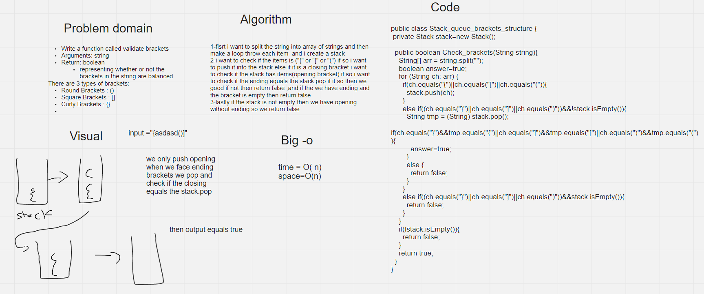

# Challenge Summary

Write a function called validate brackets

Arguments: string

Return: boolean

representing whether the brackets in the string are balanced

There are 3 types of brackets:

Round Brackets : ()

Square Brackets : []

Curly Brackets : {}

## Whiteboard Process

## Approach & Efficiency

1-fisrt i want to split the string into array of strings and then make a loop throw each item  and i create a stack

2-i want to check if the items is ("{" or "[" or "(") if so i want to push it into the stack else if it is a closing bracket i want to check if the stack has items(opening bracket) if so i want to check if the ending equals the stack.pop if it so then we good if not then return false ,and if the we have ending and the bracket is empty then return false

3-lastly if the stack is not empty then we have opening without ending so we return false

Big-O

Time=o(n)

space=o(n)

## Solution

Stack_queue_brackets_structure s= new Stack_queue_brackets_structure();

String test= "[}";

System.out.println(s.Check_brackets(test));

### this well return false

Stack_queue_brackets_structure s= new Stack_queue_brackets_structure();

String test= "[{}]";

System.out.println(s.Check_brackets(test));

### this well return true
