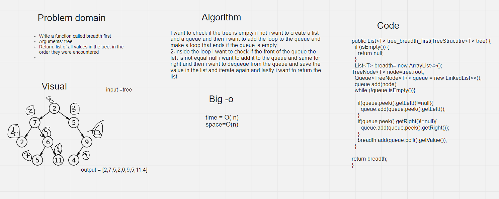

# Challenge Summary
Write a function called breadth first

Arguments: tree

Return: list of all values in the tree, in the order they were encountered

## Whiteboard Process



## Approach & Efficiency

1-I want to check if the tree is empty if not i want to create a list and a queue and then i want to add the loop to the queue and make a loop that ends if the queue is empty

2-inside the loop i want to check if the front of the queue the left is not equal null i want to add it to the queue and same for right and then i want to dequeue from the queue and save the value in the list and iterate again and lastly i want to return the list

Big-O

time=O(n)

space=O(n)

## Solution
```
TreeStrucutre<Integer> binaryTree= new TreeStrucutre<>();
binaryTree.insert(10);
binaryTree.insert(5);
binaryTree.insert(2);
binaryTree.insert(15);
binaryTree.insert(12);
binaryTree.insert(20);

list= binaryTree.tree_breadth_first(binaryTree);
    System.out.println(list);

```

output=[10, 5, 15, 2, 12, 20]
