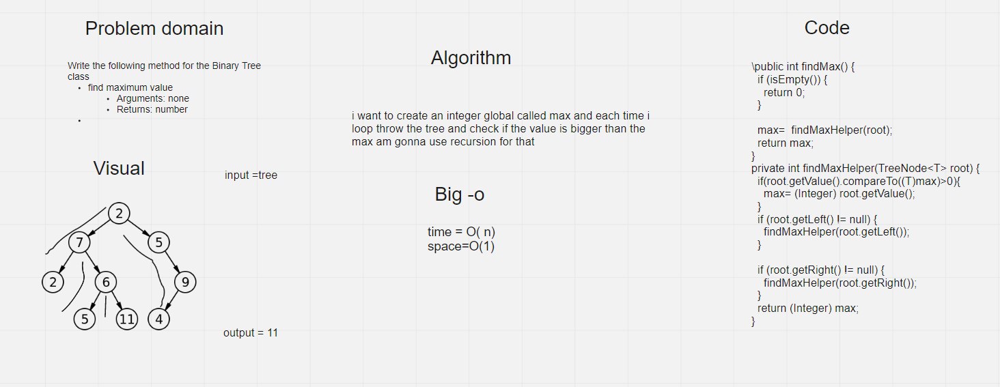

# Challenge Summary

Write the following method for the Binary Tree class

find maximum value

Arguments: none

Returns: number


## Whiteboard Process



## Approach & Efficiency

i want to create an integer global called max and each time i loop throw the tree and check if the value is bigger than the max am gonna use recursion for that

Big-O

time=O(n)

space=O(n)

## Solution
``` TreeStrucutre<Integer> binaryTree= new TreeStrucutre<>();
    binaryTree.insert(10);
    binaryTree.insert(5);
    binaryTree.insert(2);
    binaryTree.insert(15);
    binaryTree.insert(12);
    binaryTree.insert(20);
    ```


int max =binaryTree.findMax();

System.out.println(max);

it returns 20
