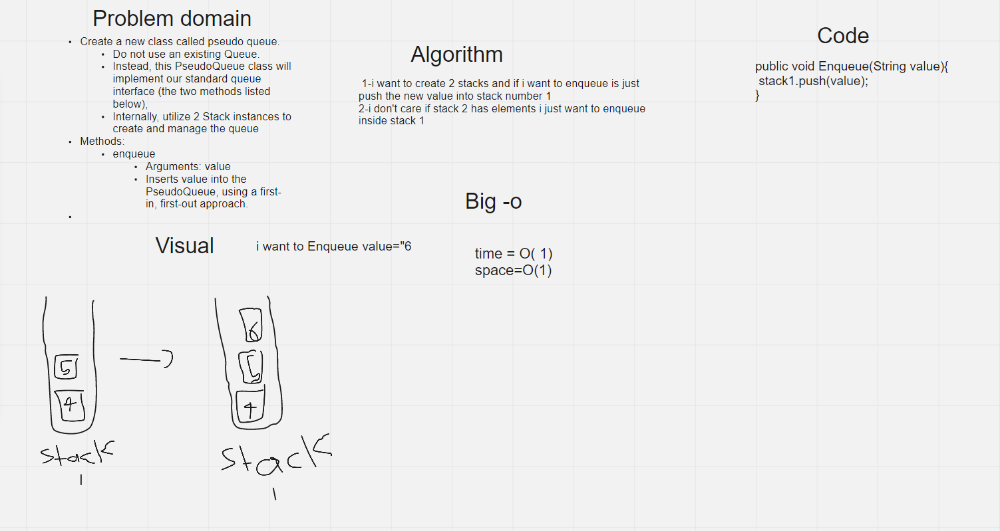
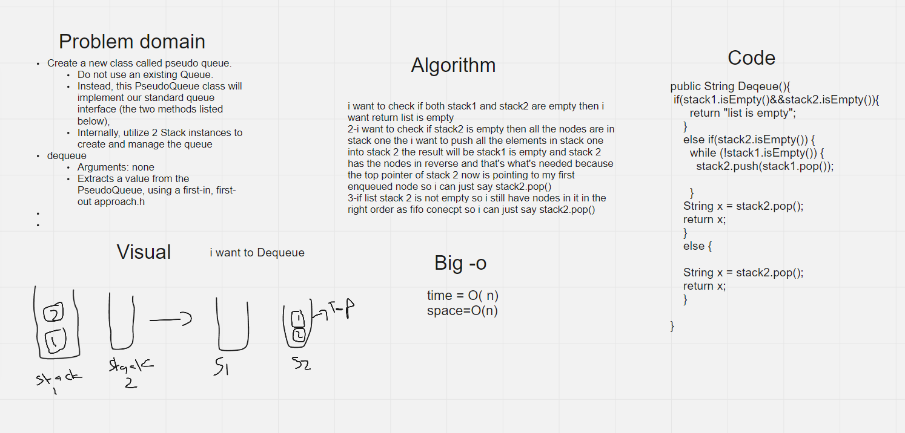

# Challenge Summary
Create a new class called pseudo queue.

Do not use an existing Queue.

Instead, this PseudoQueue class will implement our standard queue interface (the two methods listed below),

Internally, utilize 2 Stack instances to create and manage the queue

Methods:

#### enqueue

Arguments: value

Inserts value into the PseudoQueue, using a first-in, first-out approach.

#### dequeue

Arguments: none

Extracts a value from the PseudoQueue, using a first-in, first-out approach.h

## Whiteboard Process




## Approach & Efficiency

## Enqueue

i just want to push the value  into stack1

## Dequeue

i want to check if both stack1 and stack2 are empty then i want return list is empty

2-i want to check if stack2 is empty then all the nodes are in stack one the i want to push all the elements in stack one into stack 2 the result will be stack1 is empty and stack 2 has the nodes in reverse and that's what's needed because the top pointer of stack 2 now is pointing to my first enqueued node so i can just say stack2.pop()

3-if list stack 2 is not empty so i still have nodes in it in the right order as fifo conecpt so i can just say stack2.pop()

## Solution
```
Pseudo_Structure pseudo=new Pseudo_Structure();
    System.out.println(pseudo.Deqeue());
    pseudo.Enqueue("1");
    pseudo.Enqueue("2");
    pseudo.Enqueue("3");
    pseudo.Enqueue("4");
    pseudo.Enqueue("5");
    System.out.println(pseudo.Deqeue());
    System.out.println(pseudo.to_string());
    System.out.println(pseudo.Deqeue());
    pseudo.Enqueue("7");
    pseudo.Enqueue("8");
    System.out.println(pseudo.to_string());
    System.out.println(pseudo.Deqeue());
    System.out.println(pseudo.to_string());

```

### Output

list is empty

1

stack one : List is empty||stack two : { 2 } -> { 3 } -> { 4 } -> { 5 } -> NULL

2

stack one : { 8 } -> { 7 } -> NULL||stack two : { 3 } -> { 4 } -> { 5 } -> NULL

3

stack one : { 8 } -> { 7 } -> NULL||stack two : { 4 } -> { 5 } -> NULL

