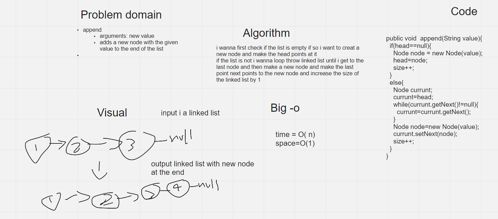
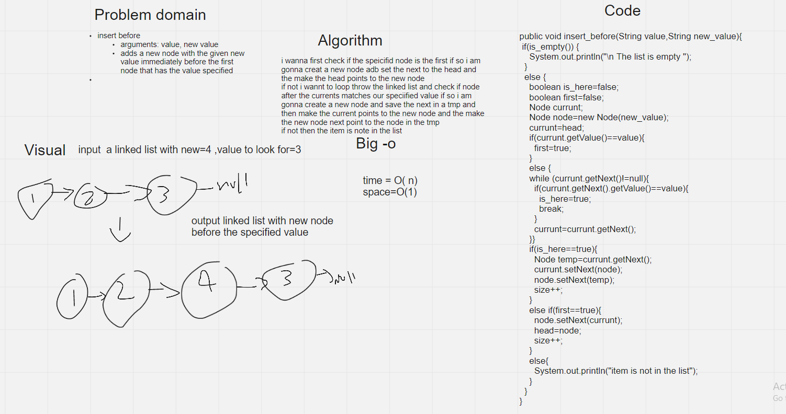
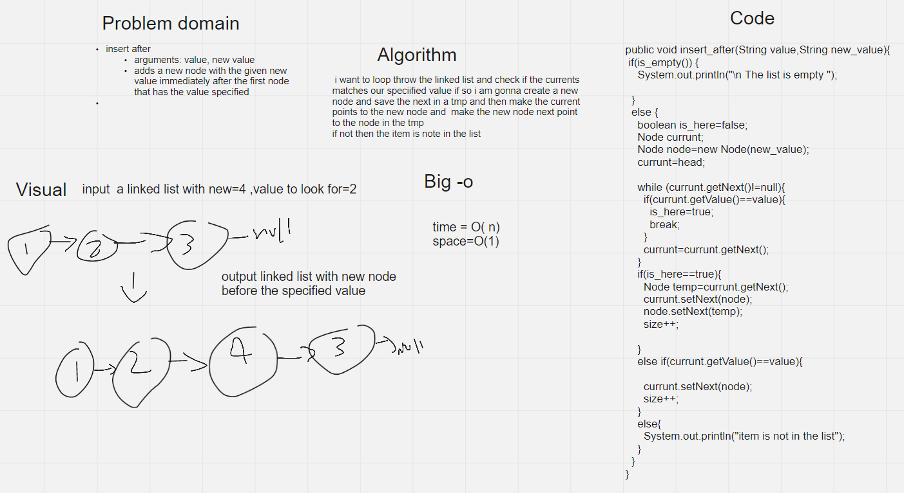

# Challenge Summary
### append :
arguments: new value

adds a new node with the given value to the end of the list

### insert before

arguments: value, new value

adds a new node with the given new value immediately before the first node that has the value specified

### insert after
arguments: value, new value

adds a new node with the given new value immediately after the first node that has the value specified

## Whiteboard Process

## Approach & Efficiency

### Apend

i want to loop throw the linked list and check if the currents matches our speciified value if so i am gonna create a new node and save the next in a tmp and then make the current points to the new node and  make the new node next point to the node in the tmp
if not then the item is note in the list

big-o

time=o(n)

space=o(1)

### insert before

i wanna first check if the speicifid node is the first if so i am gonna creat a new node adb set the next to the head and the make the head points to the new node
if not i wannt to loop throw the linked list and check if node after the currents matches our speciified value if so i am gonna create a new node and save the next in a tmp and then make the current points to the new node and the make the new node next point to the node in the tmp
if not then the item is note in the list

big-o

time=o(n)

space=o(1)

### insert after

i want to loop throw the linked list and check if the currents matches our speciified value if so i am gonna create a new node and save the next in a tmp and then make the current points to the new node and  make the new node next point to the node in the tmp
if not then the item is note in the list

big-o

time=o(n)

space=o(1)

## Solution

### linkedlist.append(5)

head -> [1] -> [3] -> [2] -> X	5	head -> [1] -> [3] -> [2] -> [5] -> X

head -> X	1	head -> [1] -> X

### linkedlist.insert_befor

head -> [1] -> [3] -> [2] -> X	3, 5	head -> [1] -> [5] -> [3] -> [2] -> X

### linkedlist.insert_after
