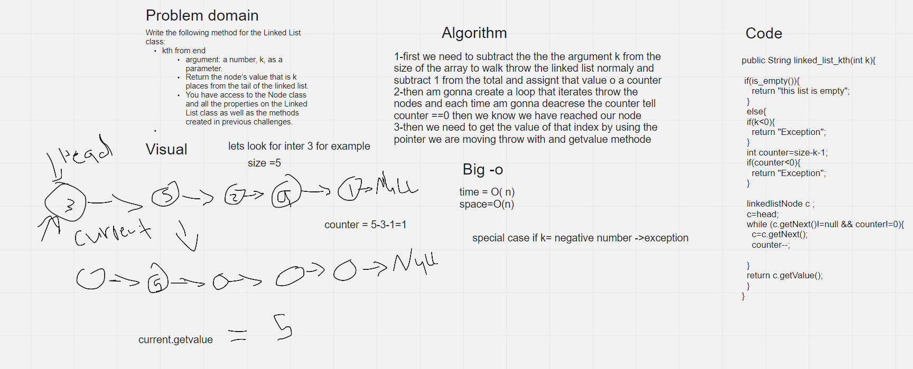

# Challenge Summary
Write the following method for the Linked List class:
kth from end
argument: a number, k, as a parameter.
Return the node’s value that is k places from the tail of the linked list.
You have access to the Node class and all the properties on the Linked List class as well as the methods created in previous challenges.

## Whiteboard Process

## Approach & Efficiency
1-first we need to subtract the the the argument k from the size of the array to walk throw the linked list normaly and subtract 1 from the total and assignt that value o a counter
2-then am gonna create a loop that iterates throw the nodes and each time am gonna deacrese the counter tell counter ==0 then we know we have reached our node
3-then we need to get the value of that index by using the pointer we are moving throw with and getvalue methode

big o
time=o(n)
space = o(n)

## Solution

{ 9 } -> { 1 } -> { 15 } -> { 5 } -> { 16 } -> { 3 } -> { 10 } -> NULL

System.out.println(list.linked_list_kth(2));

15
