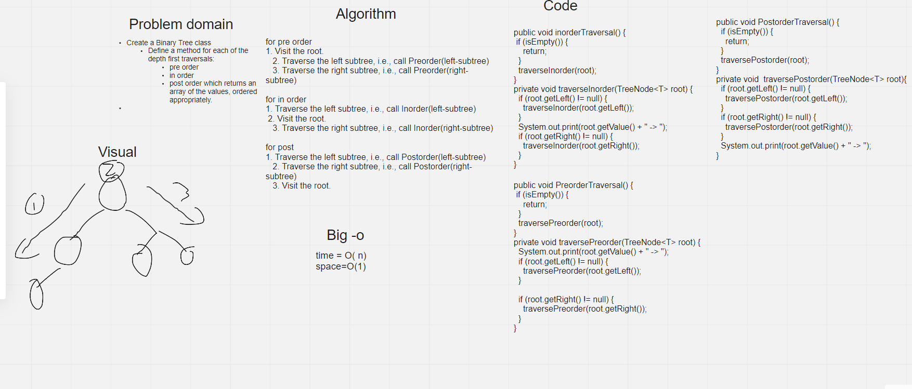
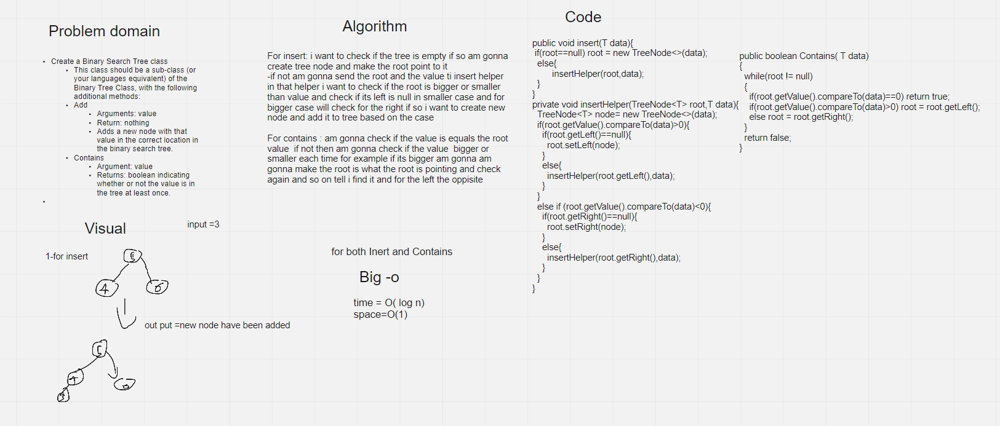

# Trees
In computer science, a binary tree is a tree data structure in which each node has at most two children, which are referred to as the left child and the right child. ... It is also possible to interpret a binary tree as an undirected, rather than a directed graph, in which case a binary tree is an ordered, rooted tree.

## Challenge

Create a Binary Tree class

Define a method for each of the depth first traversals:

* pre order
* in order
* post order which returns an array of the values, ordered appropriately.

Create a Binary Search Tree class

This class should be a sub-class (or your languages equivalent) of the Binary Tree Class, with the following additional methods:

* Add
* Arguments: value
* Return: nothing

Adds a new node with that value in the correct location in the binary search tree.

* Contains
* Argument: value
* Returns: boolean indicating whether or not the value is in the tree at least once.

## Approach & Efficiency

For insert:

Big o=O(log n)

i want to check if the tree is empty if so am gonna create tree node and make the root point to it
-if not am gonna send the root and the value ti insert helper
in that helper i want to check if the root is bigger or smaller than value and check if its left is null in smaller case and for bigger case will check for the right if so i want to create new node and add it to tree based on the case

For contains :

Big o=O(log n)

am gonna check if the value is equals the root value  if not then am gonna check if the value  bigger or smaller each time for example if its bigger am gonna am gonna make the root is what the root is pointing and check again and so on tell i find it and for the left the oppisite

For Traversals:

Big O= O(n)

Algorithm Inorder(tree)
1. Traverse the left subtree, i.e., call Inorder(left-subtree)
2. Visit the root.
3. Traverse the right subtree, i.e., call Inorder(right-subtree)

Algorithm Preorder(tree)
1. Visit the root.
2. Traverse the left subtree, i.e., call Preorder(left-subtree)
3. Traverse the right subtree, i.e., call Preorder(right-subtree)

Algorithm Postorder(tree)
1. Traverse the left subtree, i.e., call Postorder(left-subtree)
2. Traverse the right subtree, i.e., call Postorder(right-subtree)
3. Visit the root.

### Whiteboards

