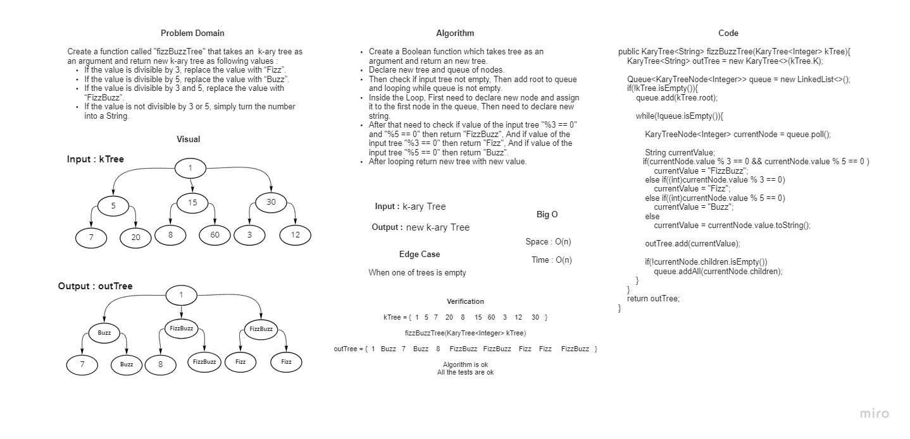

# Challenge Summary

Write a function called fizz buzz tree

Arguments: k-ary tree

Return: new k-ary tree

## Whiteboard Process



## Approach & Efficiency

creat a boolean function which takes tree as an argument and return boolean

Declear new tree and queueu of the nodes then check if it is empty and enqueu the root to the qeueu

now we need to loop until the queue is empty and enqeueu all the childs of the root and check if its

1- %5 ==0 and 3%==0 then assign "fizzbuzz"

2- 5%==0 then buzz

3- 3%==0 the fizz


Big -O

time =O(n)

space=O(n)

## Solution

```angular2html
fizzbuzz.(binaryTree tree );
```

it well return a tree with with new value according to

1- %5 ==0 and 3%==0 then assign "fizzbuzz"

2- 5%==0 then buzz

3- 3%==0 the fizz
