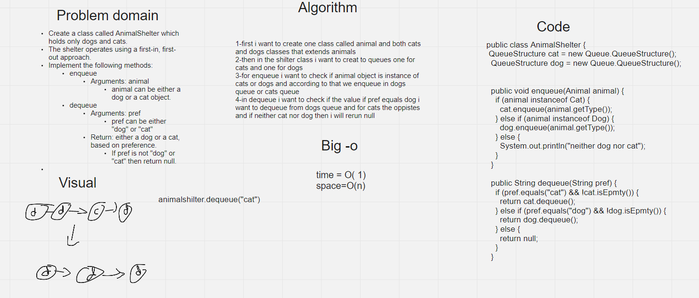

# Challenge Summary

Create a class called AnimalShelter which holds only dogs and cats.

The shelter operates using a first-in, first-out approach.

Implement the following methods:

enqueue

Arguments: animal

animal can be either a dog or a cat object.

dequeue

Arguments: pref

pref can be either "dog" or "cat"

Return: either a dog or a cat, based on preference.

If pref is not "dog" or "cat" then return null.


## Whiteboard Process



## Approach & Efficiency

1-first i want to create one class called animal and both cats and dogs classes that extends animals

2-then in the shilter class i want to creat to queues one for cats and one for dogs

3-for enqueue i want to check if animal object is instance of cats or dogs and according to that we enqueue in dogs queue or cats queue

4-in dequeue i want to check if the value if pref equals dog i want to dequeue from dogs queue and for cats the oppistes and if neither cat nor dog then i will rerun null

### Big-O

Time =O(1)

Space=O(1)

## Solution


```
AnimalShelter animalShelter= new AnimalShelter();
Animal dog=new Dog();
Animal cat= new Cat();
animalShelter.enqueue(dog);
animalShelter.enqueue(cat);
animalShelter.enqueue(dog);
animalShelter.enqueue(dog);
animalShelter.enqueue(cat);
animalShelter.enqueue(dog);
animalShelter.dequeue("cat");
animalShelter.dequeue("dog");
System.out.println(animalShelter.to_string());
```

##### Output

dogs :{ dog } -> { dog } -> { dog } -> NULL  ||| cats :{ cat } -> NULL
