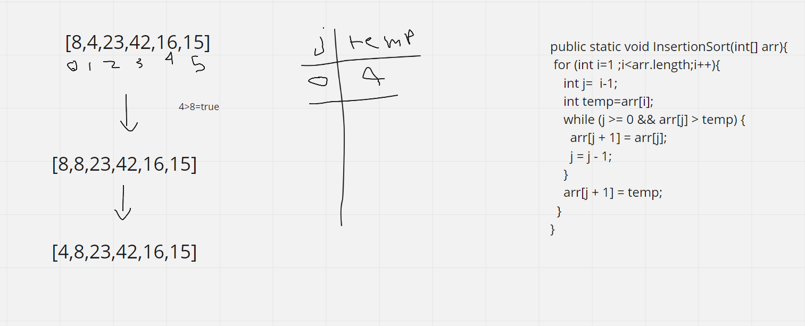
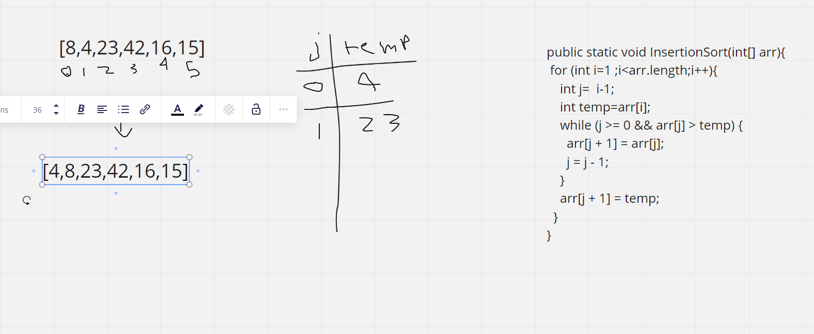
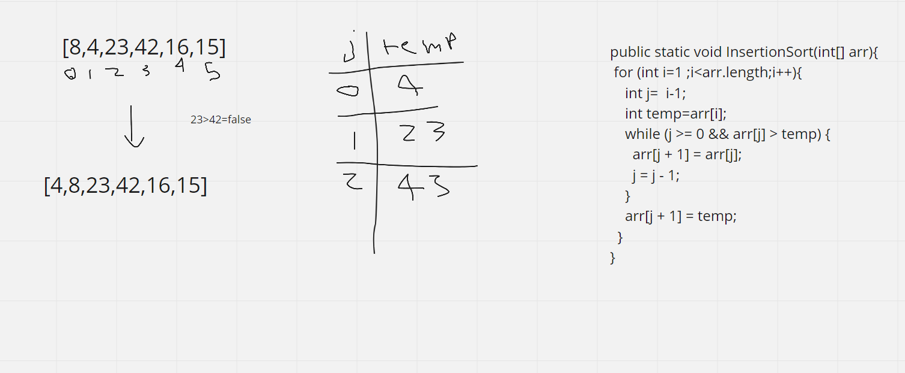
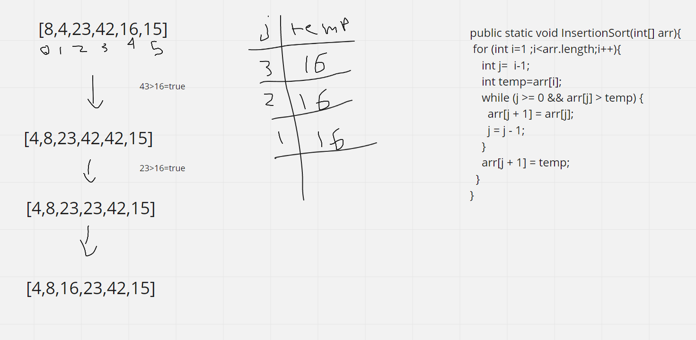
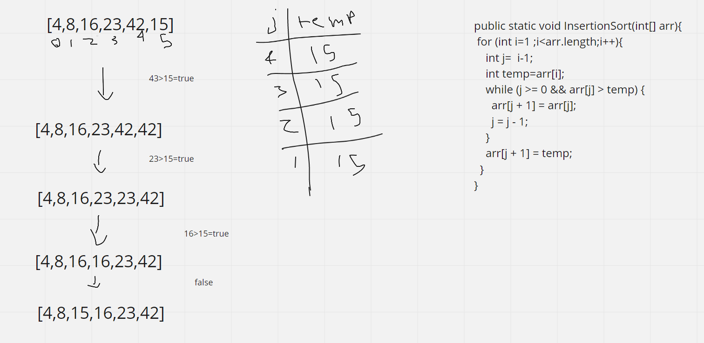

Insertion Sort

Insertion sort is a simple sorting algorithm that works similar to the way you sort playing cards in your hands. The array is virtually split into a sorted and an unsorted part. Values from the unsorted part are picked and placed at the correct position in the sorted part.

Pseudocode

```angular2html
  InsertionSort(int[] arr)

    FOR i = 1 to arr.length

      int j <-- i - 1
      int temp <-- arr[i]

      WHILE j >= 0 AND temp < arr[j]
        arr[j + 1] <-- arr[j]
        j <-- j - 1

      arr[j + 1] <-- temp
```


Trace
Sample Array: [8,4,23,42,16,15]

Pass 1:

Pass 1 of Insertion Sort

The fist iteration i = 1. Since 4 is smaller than 8, move 8 and insert 4 before 8



Pass 2:

Pass 2 of Insertion Sort

The second iteration i = 2. Since 23 is bigger than 8, so it's the same



Pass 3:

Pass 3 of Insertion Sort

The three iteration i = 2. Since 42 is bigger than 23, so its the same



Pass 4:

Pass 4 of Insertion Sort




Pass 5:

Pass 5 of Insertion Sort




Efficency
Time: O(n^2)

Space: O(1)
No additional space is being created. This array is being sorted in place…keeping the space at constant O(1).
