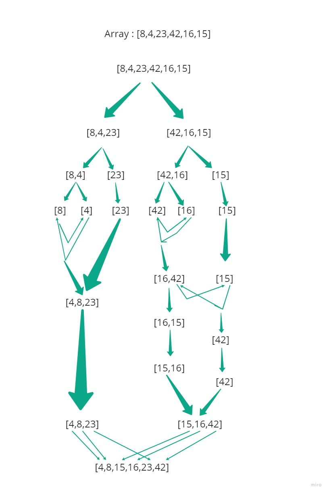

# Merge Sort

Sorting an array by dividing it to two half each time until it is sorted from the smallest to the largest number and then merge it.

### Pseudocode

```
 public void MergeSort(int[] arr){
    int length=arr.length;
    if(length<2){
      return ;
    }
    int mid = length/2;
    int[] left = new int[mid];
    int[] right=new int [length-mid];
    for(int i=0;i<mid;i++){
      left[i]=arr[i];
    }
    for(int j=mid;j<length;j++){
      right[j-mid]=arr[j];
    }
    MergeSort(left);
    MergeSort(right);
    Merge(left,right,arr);
  }
  private void Merge(int[] left,int[] right,int[] arr){
    int i=0;
    int j=0;
    int k=0;
    while (i<left.length&& j<right.length){
      if (left[i]<=right[j]){
        arr[k++]=left[i++];
      }
      else {
        arr[k++]=right[j++];
      }
    }
    while (i<left.length){
      arr[k++]=left[i++];
    }
    while (j<right.length){
      arr[k++]=right[j++];
    }
  }
```

### Trace

```Array: [8,4,23,42,16,15]```

###### Pass1:
in the first pass, the array will be split to two half.

###### Pass 2
the two half will be split again, so we have 4 arrays.

###### Pass 3
the arrays which have more than one element will be split again, so we have 6 arrays.

###### Pass 4
The left side will be sorted.

###### Pass 5
The right side will be sorted

###### Pass 6
after the sorting finish, the arrays will be merged into one array.

###### Pass 7
Final iteration will be the finished merged array.



### Efficiency

Time efficiency: O(n log n)

Space efficiency: O(1)
