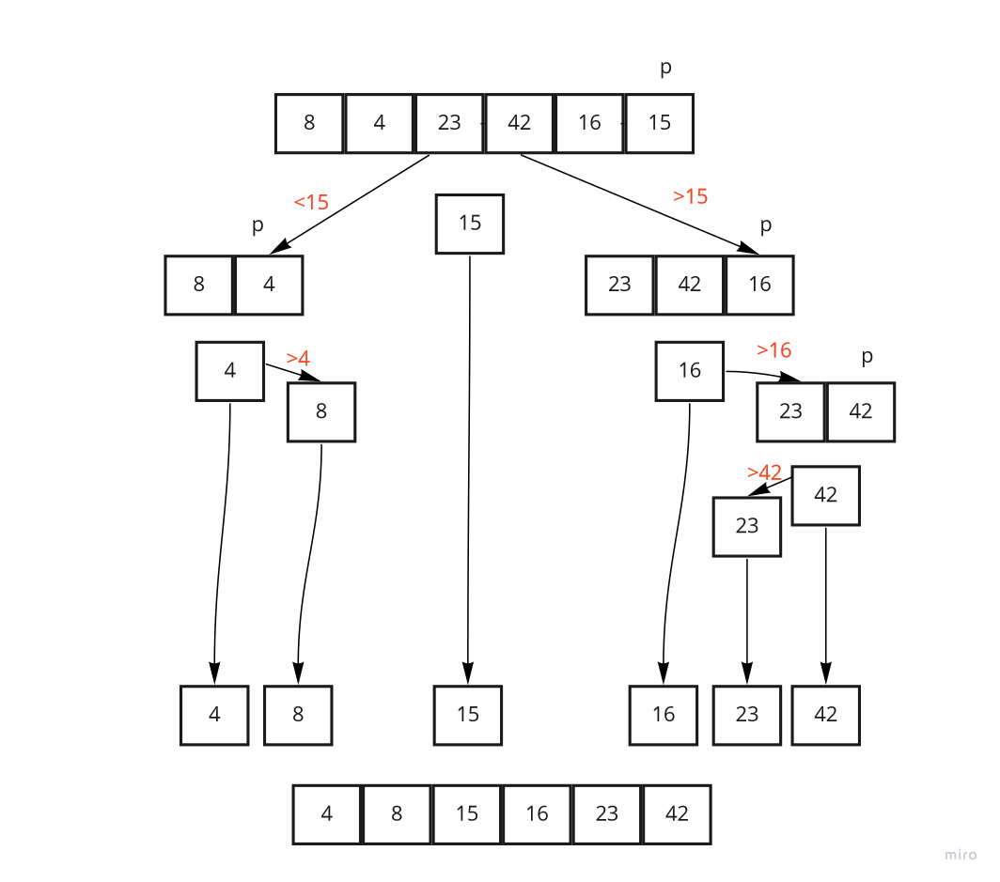

# Quick Sort

QuickSort is a Divide and Conquer algorithm. It picks an element as pivot and partitions the given array around the picked pivot.

# Code

```
public  void swap(int[] array, int x, int y) {
int currentArr = array[x];
array[x] = array[y];
array[y] = currentArr;
}
public  int partition(int[] array, int x, int y) {
int pivot = array[y];
int i = (x - 1);

    for(int j = x; j < y ; j++) {
      if (array[j] < pivot){
        i++;
        swap(array, i, j);
      }
    }
    swap(array, i + 1, y);
    return (i + 1);
}
public   void quickSort(int[] array, int x, int y) {
if (x < y){
int index= partition(array, x, y);
quickSort(array, x, index - 1);
quickSort(array, index + 1, y);
}
}
```


# Trace


Sample Array: [8,4,23,42,16,15]

we take pivot as final value
for each pass we take pivot then divide values in less than pivot and more than pivot
and do this step until finish and sort  all value



# Efficency

    Time: O(n^2)
    Space: O(1)
        No additional space is being created. This array is being sorted in place…keeping the space at constant O(1).
